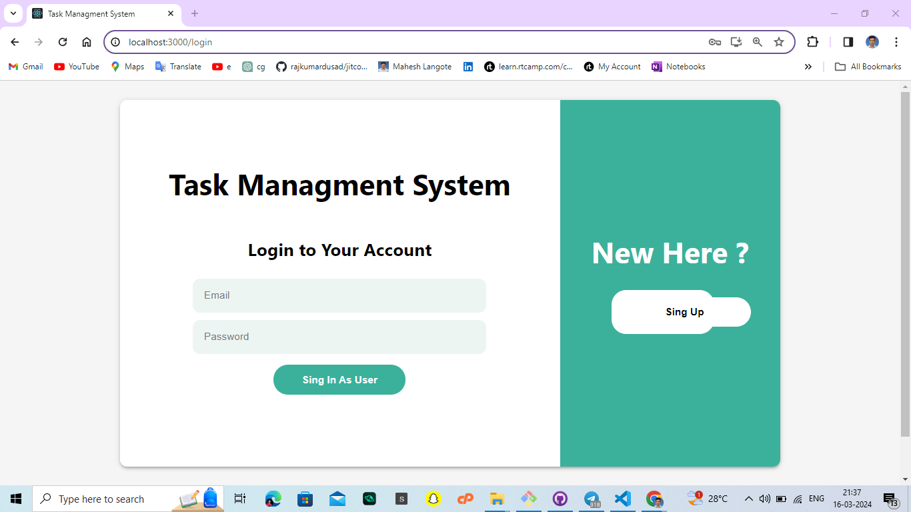
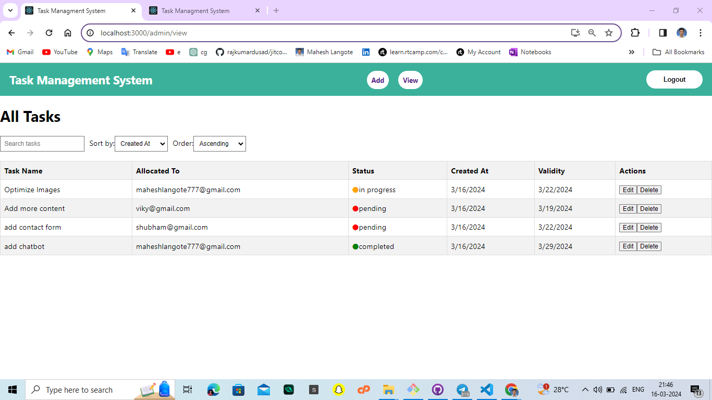
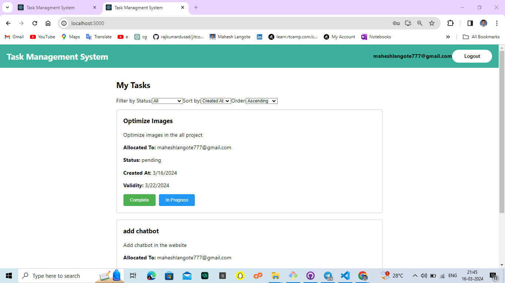
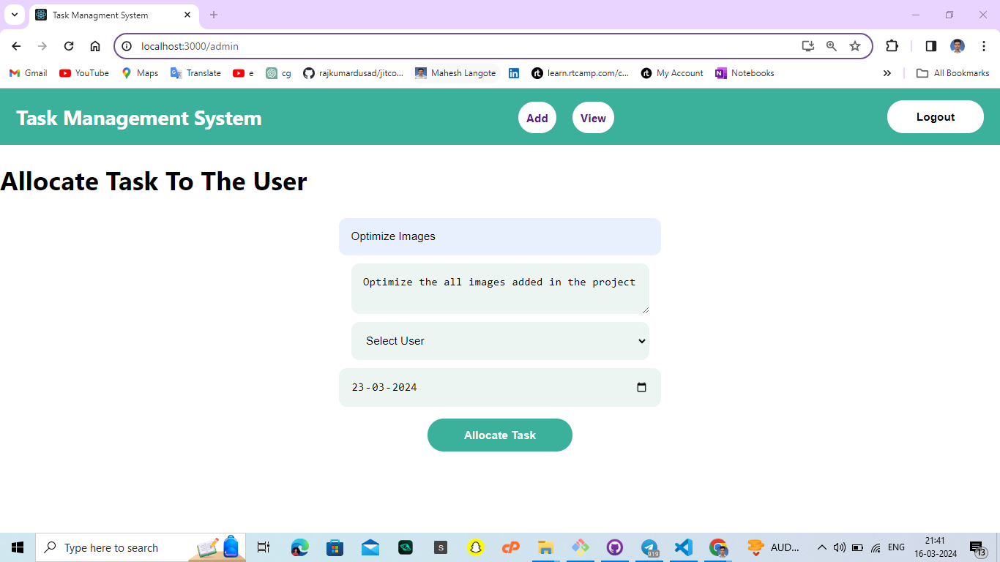
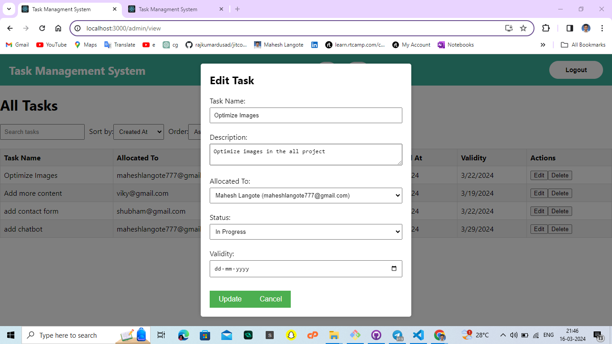

# Task Management Application

This is a simple task management application that allows users to view, allocate, update tasks, as well as search and sort tasks based on various criteria.

## Screenshots

### Log In Page


### Admin View


### User View


### Allocate Task


### Edit Task (Admin)


## Features

- **View Tasks**: Users can view tasks allocated to them.

- **Allocate Tasks**: Users can allocate tasks to themselves or others.

- **Update Task**: Admin can update tasks.

- **Update Task Status**

- **Search Functionality**: Users can search for specific tasks using keywords.

- **Sort Functionality**: Tasks can be sorted based on various criteria such as status, Name, due date, etc.

## Getting Started

### Prerequisites

- Node.js installed on your machine
- MongoDB database running locally or remotely (with connection details available)

### Installation

1. Clone this repository to your local machine:

    ```bash
    git clone https://github.com/Mahesh-Langote/musterDekhoAssignment.git
    ```

2. Navigate to the project directory:

    ```bash
    cd musterDekhoAssignment
    ```

3. Install dependencies:

    ```bash
    npm install
    ```

### Configuration

1. Set up your MongoDB database and obtain the connection URI.

2. Create a `.env` file in the root directory of the project.

3. Add the MongoDB connection URI to the `.env` file:

    ```
    MONGODB_URI=<your_mongodb_connection_uri>
    ```

### Usage

1. Start the server:

    ```bash
    npm start
    ```

2. The server should start running at `http://localhost:8080`.

3. Open your web browser and navigate to `http://localhost:3000` to access the application.

### Logging Out

To log out of the application, simply click on the "Logout" button, and you will be redirected to the login page.

## Technologies Used

- Node.js
- Express.js
- MongoDB
- React
- Axios
- CSS Modules

## Contributing

Contributions are welcome! Feel free to submit issues or pull requests for any improvements or bug fixes.
